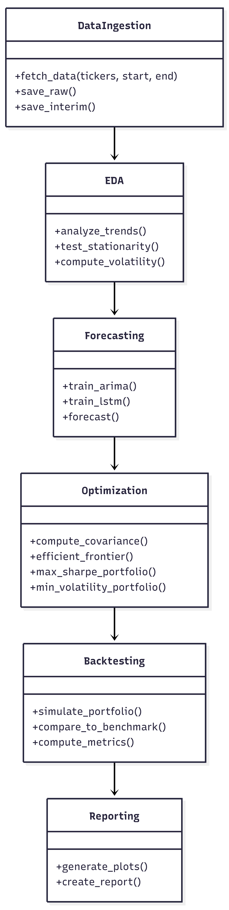

# Portfolio Management Optimization

Designing, Optimizing, and Evaluating Investment Portfolios Against a 60/40 Benchmark

An end-to-end quantitative investment analytics pipeline that transforms raw market data into optimized portfolios and evaluates performance against an industry-standard benchmark.

---

## Project Overview

This project implements a **production-grade investment research pipeline** that:

- Ingests historical market data
- Forecasts expected returns and risk
- Constructs optimized portfolios using Modern Portfolio Theory (MPT)
- Backtests strategies against a **60% equity / 40% bond benchmark**
- Produces executive-ready performance and risk insights

---

## Objectives

- Build a modular, reproducible investment analytics system
- Apply time-series forecasting for expected returns
- Optimize portfolios using Modern Portfolio Theory
- Compare performance against a 60/40 benchmark
- Generate clear analytical and executive reports

---

## Project Structure

```
portfolio-management-optimization/
├── config/
├── data/
│   ├── raw/
│   ├── interim/
│   └── processed/
├── notebooks/
├── reports/
├── src/
│   └── portfolio_management_optimization/
│       ├── core/
│       ├── data/
│       ├── forecasting/
│       ├── optimization/
│       ├── backtesting/
│       ├── benchmarks/
│       ├── reporting/
│       ├── pipeline/
│       └── utils/
├── tests/
├── scripts/
├── docker/
├── pyproject.toml
├── init_setup.sh
└── README.md
```

---

## Data

Market data sourced using **Yahoo Finance (YFinance)**.

Assets:

- TSLA – Growth asset
- SPY – Equity market proxy
- BND – Fixed-income stability

---

## Methods

- Forecasting: ARIMA, LSTM
- Optimization: Efficient Frontier, Max Sharpe, Min Volatility
- Benchmark: 60% SPY / 40% BND
- Metrics: Sharpe Ratio, Volatility, Max Drawdown

---

## Tech Stack

Python, Pandas, NumPy, SciPy  
Statsmodels, TensorFlow  
PyPortfolioOpt  
Matplotlib, Pytest  
Docker (optional)

---

## Methodology & Architecture

The pipeline follows **industry-standard quantitative research workflow**:

1. **Data Ingestion**
   - Pull historical market data from Yahoo Finance (YFinance).
   - Store raw, interim (cleaned & feature-engineered), and processed datasets.

2. **Exploratory Data Analysis (EDA)**
   - Statistical checks (ADF test for stationarity).
   - Rolling volatility, correlations, and outlier detection.

3. **Forecasting**
   - **ARIMA/SARIMA**: Captures linear trends and seasonality.
   - **LSTM**: Captures non-linear dependencies and high-volatility behavior.

4. **Portfolio Optimization**
   - Apply **Modern Portfolio Theory (MPT)**.
   - Generate Efficient Frontier: Max Sharpe Ratio & Min Volatility portfolios.

5. **Backtesting & Benchmarking**
   - Compare optimized portfolio against **60% SPY / 40% BND benchmark**.
   - Metrics: Sharpe Ratio, Max Drawdown, Cumulative Return.

6. **Reporting**
   - Generate executive-ready visualizations and insights.
   - Includes risk-adjusted performance and investment recommendations.

---

### Architecture

class diagram

## 

## Disclaimer

This project is for educational and research purposes only.  
It does not constitute financial advice.

---

## Author

Daniel Gashaw Kebede
